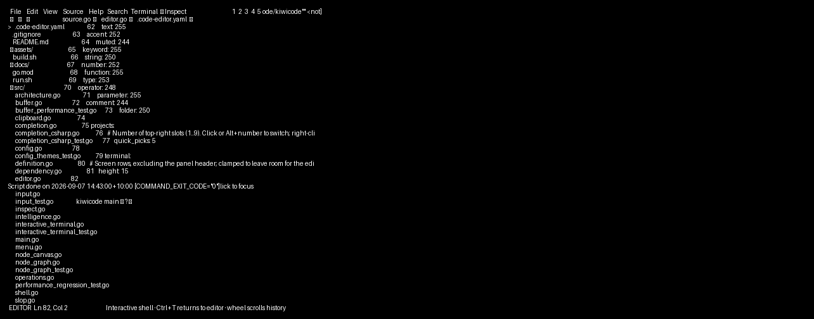
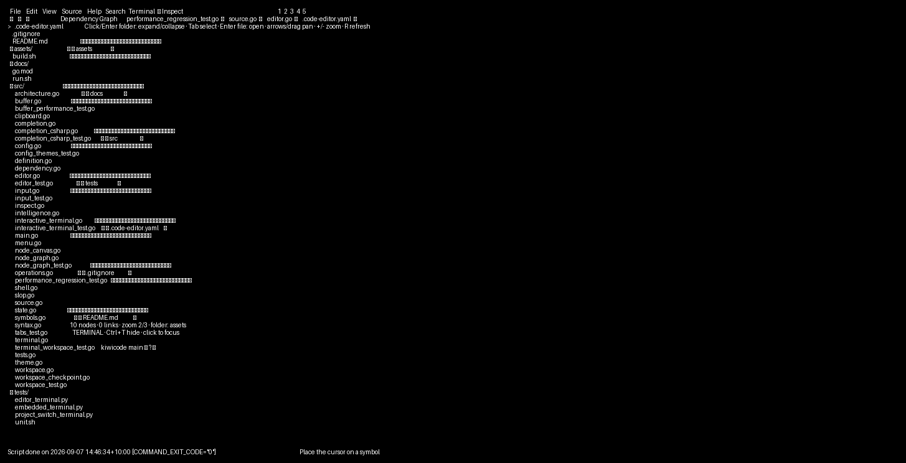

<p align="center">
  
</p>

<h1 align="center">KiwiCode</h1>

<p align="center">
  <strong>A terminal-native code editor, built in Go.</strong><br>
  Explore a codebase, edit files, find functions, and run tests in one keyboard-friendly workspace.
</p>

<p align="center">
  
  
  
</p>


*The included [Taskboard example](examples/taskboard), running in KiwiCode with the Forest theme.
The file explorer is expanded and `internal/httpapi/tasks.go` is open alongside `main.go`.*

---

## Why KiwiCode?

KiwiCode brings code editing and a real shell into one keyboard-friendly workspace:

- Default-open interactive terminal for shell commands and coding CLIs
- Full-screen tools such as Architecture Canvas render as tabs instead of overlays
- Bounded streaming queues and history, batched input, coalesced rendering, and resize-event handling
- 🌈 Syntax colours for Go, Ruby/Rails, C#, HTML/XML, JavaScript/TypeScript, Python, Rust, C/C++, Java, SQL, JSON, YAML, HCL, and more
- ⚡ Immediate UI startup with project scanning, state restoration, and indexing off the UI thread
- ⚡ Configurable project slots in the top-right (five by default); right-click to assign, then click or press **Alt+number** to switch
- ⚡ Project switching retains complete workspaces (buffers, undo history, file trees and terminal sessions) in a bounded memory cache; first visits show a loading indicator
- Workspace checkpoints and folder transitions run off the UI thread; slow switches show an animated modal over the current workspace and continue processing terminal resize events
- Returning to a cached slot does not wait for disk checkpoints; each project's writes are ordered and pending snapshots are coalesced
- 🔎 Fast file, symbol, member, and go-to-definition lookup
- C# completion caches receiver types, follows simple awaited method return types, and supplies common collection/LINQ members (`members.Gr` → `GroupBy`), including continued lines and completion before parentheses
- 🧪 Run Tests button with stop/rerun, captured results, and a test explorer for jumping to definitions
- 🌿 Source Control with diffs, staging, guarded discard, and wrapped multiline commits
- 🎨 Plum, Forest, Amber, and Mono themes

## Quick start

Use the Go version declared in [`go.mod`](go.mod) (currently Go 1.27), a Unix-like
terminal with `stty`, and Git. Install the `sqlite3` command for workspace persistence.
Building also requires a C compiler, pkg-config, and libvterm 0.3+ development
headers (`libvterm pkgconf` on Arch; `libvterm-dev pkg-config` on Debian/Ubuntu).

```sh
git clone git@github.com:bradlnz/kiwicode.git
cd kiwicode
go build -o code-editor ./src

# Launch the same codebase used in the screenshots.
./code-editor examples/taskboard
```

Press **Ctrl+P** to show and focus the file explorer. Use the arrow keys to select
and expand folders, or click them. **Enter** opens the selected file; **Tab** returns
focus to the editor. **Ctrl+B** toggles the sidebar.

Open your own project with `./code-editor /path/to/project`, or run from source:

```sh
go run ./src examples/taskboard
```

For an installed `kiwicode` command, run `./build.sh`. It tests `./src`, builds the
editor, and installs a symlink in `${XDG_BIN_HOME:-~/.local/bin}`. Add that directory
to your `PATH` if necessary.

### A real example, not placeholder files

[Taskboard](examples/taskboard) is a small Go HTTP API with a browser client, an
in-memory task store, API documentation, and four Go tests. It has no external
package dependencies, credentials, database, or cloud services.

```sh
cd examples/taskboard
go test ./...
go run .
# Open http://127.0.0.1:8080 in your browser.
```

The example binds to loopback, is read-only, and resets its seeded tasks on restart.
It is a development sample, not a production service.

## See it in action

These are captures of the **running editor**, not UI mock-ups. The same sample
workspace is used throughout, and the file explorer remains visible during search.
The committed captures predate the new test buttons and persistent terminal;
the controls described below reflect the current editor.

### Find a file

Press **Ctrl+F** and type part of a file path. Here, `tasks` finds API code, tests,
store code, documentation, and the browser client. Use **Up/Down** to select a
result and **Enter** to open it; **Escape** cancels.


File search filters **paths**, not text inside files. Matching is case-insensitive;
the list shows up to eight results, so narrow the query when needed.

### Jump to a function

Press **Ctrl+U** to search discovered functions. Results include the file path and
line number. Searching `ListTasks` finds both implementations and the matching
test; **Enter** jumps to the selected definition.


### Explore tests

Press **Ctrl+E** to open the test explorer. **Enter** opens the selected test at its
definition. Click a row's **Run** button to run that test, or **Run Tests** in the
top bar to run the project suite.


The older screenshot's checkboxes have been replaced by per-test Run/Stop buttons.

### Run the tests

Press **Ctrl+R** or click **Run Tests**: KiwiCode detects `go test ./...`
and displays the example's actual test output. **Ctrl+T** hides the output panel.


Test commands capture output and display it when the command finishes.
The separate persistent interactive terminal supports full-screen tools and
coding CLIs; these are not demonstrated by the older screenshots.

## Everyday controls

| Key | Action |
| --- | --- |
| Mouse | Menus, tabs, file selection, folder expansion, scrolling, and code selection |
| `Ctrl+P` / `Ctrl+B` | Show and focus Files / toggle the explorer |
| `Ctrl+F` / `Ctrl+U` | Search file paths / discovered functions |
| `Ctrl+D` | Go to definition |
| `Ctrl+E` | Test Explorer |
| `Ctrl+R` | Run / stop tests (editor or test output focused) |
| `Ctrl+T` | Embedded terminal |
| `Ctrl+K` | Format current file |
| `Ctrl+G` | Dependency graph |
| `Ctrl+S` / `Ctrl+Z` | Save / undo in a file tab |
| `Ctrl+W` / `Ctrl+Q` | Close tab / quit |
| `Ctrl+O` | Shortcut help |

Closing a dirty tab or quitting with unsaved changes requires a second command.
When a search or menu is open, its own navigation keys take precedence.

## More of the workspace

**Source Control** is available from the Source menu or the sidebar's branch icon:
review diffs, stage changes, and compose commits. Discard operations are guarded.

Use the embedded terminal to run, build, test, debug, or launch containers with your usual shell commands.
Click **Run Tests** in the top bar, press **Ctrl+R**, or choose **Run All Tests**
from a test's context menu. Save edited files first.
Each test row also has a **Run** button for that test alone, changing to **Stop**
while it runs. Click the name to open the definition, or use the row's
**Run / Stop Selected Test** context action. Built-in filters support Go,
ordinary Python/C# test classes, Maven, Jest and Vitest. Custom runners and
nested test classes can supply a selected-test command; placeholders are
shell-quoted automatically:

```yaml
tests:
  selected_command: my-runner --file {file} --test {name} --line {line}
```

The top-bar button changes to
**Stop Tests** while running; click again after completion to rerun.
Output appears in the bottom panel when the command finishes, including pass/fail
or cancellation status. Clicking Stop again forces a stuck command to exit.

Root manifests select Go, Cargo, .NET, pytest, Maven, Ruby/Rake, or a JavaScript
package's `test` script (with npm, pnpm, Yarn or Bun). For custom runners,
monorepos, Python unittest, or watch-mode scripts, set an explicit command:

```yaml
tests:
  command: go test ./...
```

Test commands run through your shell in the project directory. Ctrl+T can hide
results; toggle it again to return to the interactive shell. The existing shell
session remains available.

**Dependency Graph** (`Ctrl+G`) shows syntactic imports and interfaces.
**View → Architecture Canvas** shows a folder/dependency overview. Both support
node selection and panning; they are not language-server call graphs.

**Editing** includes syntax colours for Go, Ruby/Rails, C#, JavaScript/TypeScript,
Python, Rust, C/C++, Java, SQL, JSON, YAML, HCL, and other supported formats, plus
word wrap, completion, and formatting. Completion and definition
lookup use bounded syntax inference; they are not a replacement for full
language-server type and overload resolution.

The file tree refreshes automatically in the background every half-second.
Files and folders created, renamed, moved, or deleted from the terminal or other
tools appear without reopening the project, including empty folders. Existing
ignore rules, expanded folders, selection, and unsaved buffers are preserved.
Large directory scans can take longer than the refresh interval.





Architecture Canvas and Dependency Graph show connected, selectable nodes. Click or Tab to select;
Dependency Graph starts folder-first: click a folder (or press Enter) to expand/collapse it,
revealing its files and subfolders. Cross-folder dependencies connect the collapsed folder nodes;
external imports and interfaces appear as their files are revealed. Expansion is cached per project
and does not rescan the filesystem. Architecture Canvas keeps its full overview.
Enter opens a file/folder, arrows or background dragging pan, +/- zoom, [ and ] follow links,
F centers the selection, and R refreshes. Graphs build in the background and are cached per project.
Imports are syntactic, not a full language-server call graph; unresolved dependencies remain named nodes.
Member completion also uses bounded syntax inference, not a language server: complex expression
chains, overload resolution and exact extension-method scope are not resolved.
Views are bounded to 400 files / 600 nodes / 2,000 links, with truncation shown in the footer.

### Interactive terminal

The terminal opens by default with a persistent PTY-backed `$SHELL -i` in the project directory
(Bash by default), leaving keyboard focus in the editor. Ctrl+T toggles it.
The terminal is docked below the editor, leaving the explorer visible. Set
`terminal.height: 10` in YAML to choose its screen height in rows (3–100, plus a header).
Small windows clamp the panel height to preserve room for the editor. Click either pane
to focus it; Ctrl+T toggles the terminal without stopping its shell.
Bash loads `~/.bashrc`, so your PATH, aliases and installed `codex`/`claude` commands are available.
Output streams live, with terminal colours, cursor movement, alternate screens, mouse reporting,
resizing and 1,000 lines of scrollback. Wheel-scroll shows history when the child isn't using mouse input.
Ctrl+C, Ctrl+D, Escape, Tab and other terminal keys go to the child; Ctrl+T returns to the editor.
Alt+number and the top bar remain project shortcuts. Hidden terminal sessions survive cached project switches;
output queues are bounded (a busy inactive project eventually applies backpressure).
Sessions end on editor exit or project-cache eviction; shell processes are not restored across restarts.
Source Control operations and test runs retain captured output.

## Configuration

Use a project `.code-editor.yaml` or global `~/.config/code-editor/config.yaml`.
Project settings are read after global settings. The sample includes this layout:

```yaml
theme: forest

explorer:
  max_width_percent: 35

layout:
  top_menu_padding: 2
  tab_padding: 1
  sidebar_tab_padding: 1
  explorer_indent: 2
```

Choose `plum`, `forest`, `amber`, or `mono`; themes are also available in View.
The `colors` section overrides individual 256-colour roles. Icons and keyboard
shortcuts are configurable; see [the repository configuration](.code-editor.yaml).
Layout padding values must be between 0 and 8.

Workspace state is stored outside the project in `$XDG_STATE_HOME/code-editor`
or `~/.local/state/code-editor`, using the `sqlite3` command.

## Dependency graph MCP

Expose the compact project graph to an external MCP client:

```sh
/path/to/kiwicode/code-editor --mcp /path/to/project
```

The server provides the `project_dependency_graph` tool over stdio.

## Development

```text
kiwicode/
├── assets/             # Logo and real editor screenshots
├── examples/taskboard/ # Runnable demo; its own Go module
├── src/                # Editor, rendering, input, and integration tests
├── docs/               # Performance and screenshot guides
├── tests/              # Real-terminal smoke test and test entrypoint
├── tools/              # Repeatable README screenshot capture
├── build.sh            # Test, build, and install
└── run.sh              # Run from source
```

```sh
go test -count=1 ./...
go test -race -count=1 ./...
go vet ./...
go build -o code-editor ./src
python3 tests/editor_terminal.py ./code-editor
python3 tests/embedded_terminal.py ./code-editor

# Nested example modules are not covered by the root ./... pattern.
(cd examples/taskboard && go test -count=1 ./... && go vet ./...)
```

CI runs tests, race checks, vet, the editor build, a real-terminal smoke test, and
component benchmarks. See [performance notes](docs/performance.md); component
measurements are not whole-editor latency claims.

### Refresh the screenshots

```sh
# Debian/Ubuntu capture dependencies; Go is installed separately.
sudo apt-get install xvfb xauth xterm x11-utils fonts-dejavu-core python3-pil sqlite3 libvterm-dev pkg-config

go build -o code-editor ./src
python3 tools/capture_readme.py --binary ./code-editor
```

The capture script launches the real binary under xterm/Xvfb, drives the example
with keyboard and mouse input, checks navigation and actual test output, and
captures the X11 window. It uses a temporary copy of the example and isolated
home/state directories, then verifies the example files were not modified.

See [screenshot capture and provenance](docs/screenshots.md) for dependencies,
artifacts, assertions, and the GitHub Actions workflow.

## License

KiwiCode is licensed under the [MIT License](LICENSE).
[Third-party notices](THIRD_PARTY_NOTICES.md) include the Go and libvterm licenses.
These texts are embedded in the executable and accessible through
**Help > About / Open Source Licenses**, even when the source checkout is absent.

Clone and contribute via `github.com/bradlnz/kiwicode`.
