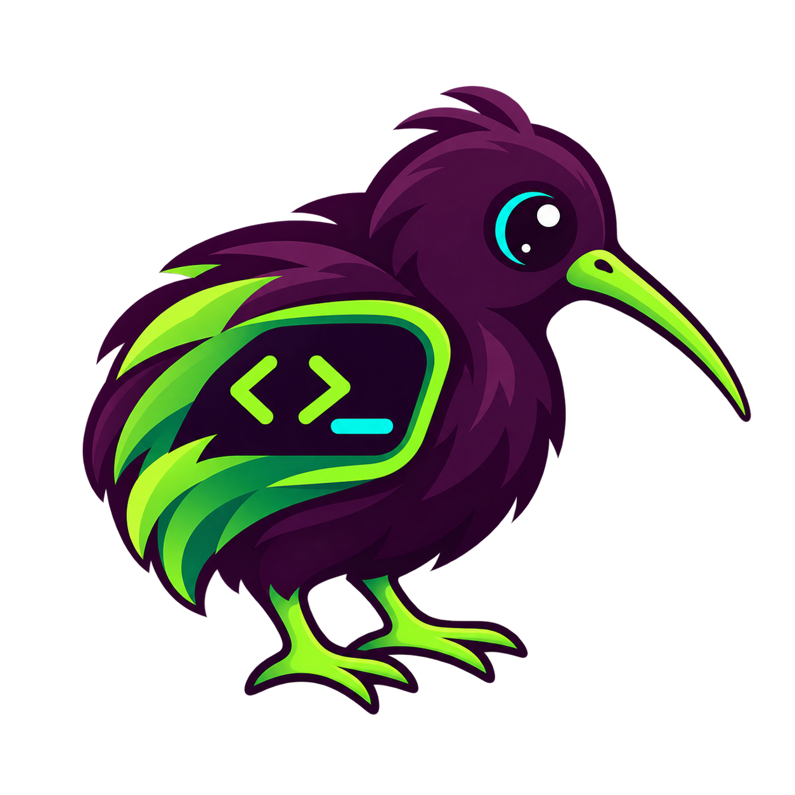
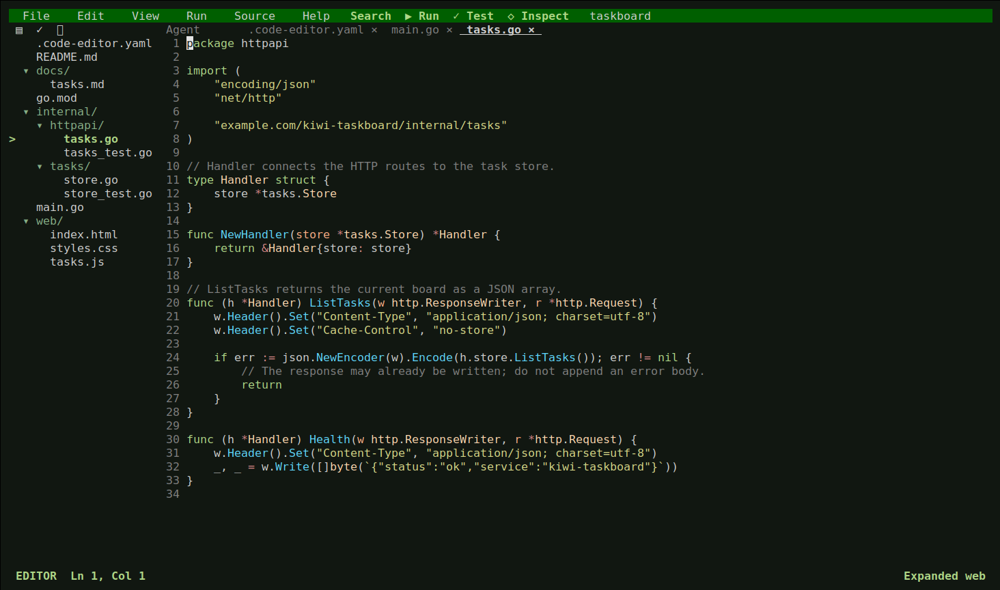
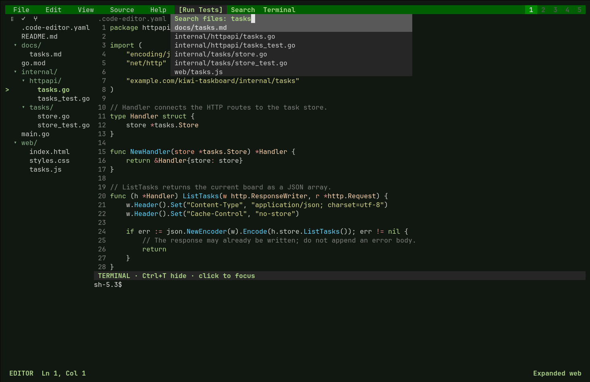
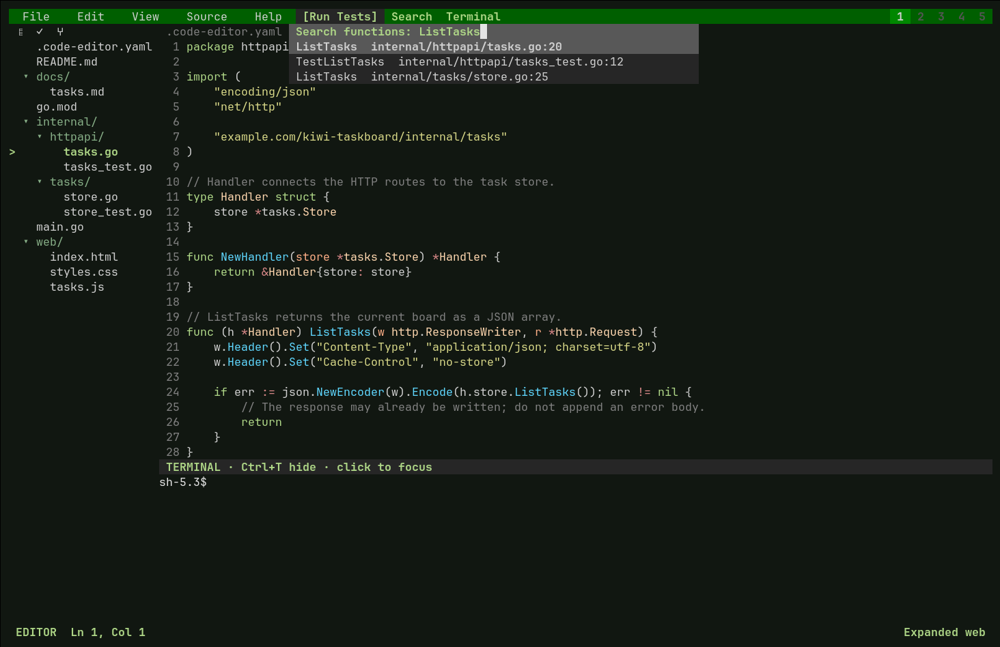
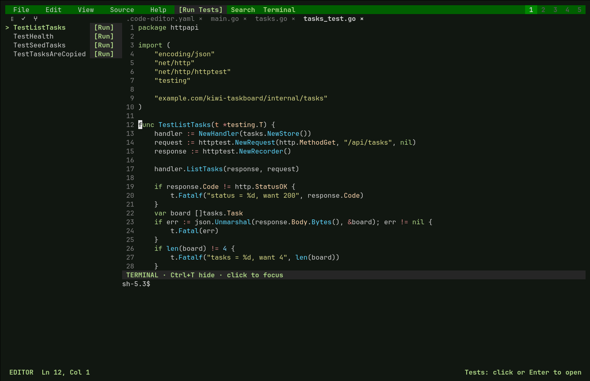
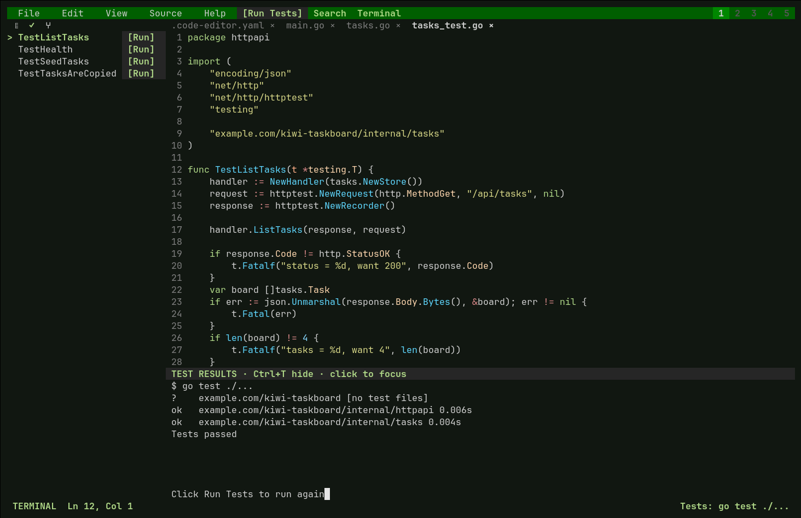
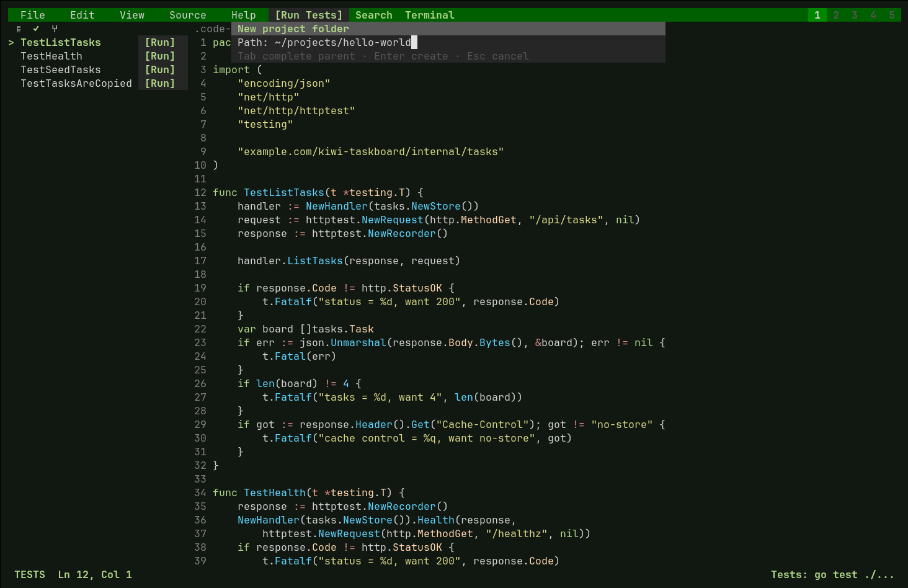

<p align="center">
  
</p>

# KiwiCode

[](LICENSE)
[](go.mod)
[](https://github.com/bradlnz/kiwicode/actions/workflows/go.yml)

An open-source terminal code editor for Linux, written in Go with a CGo/libvterm
terminal engine. Edit files, navigate symbols, run individual tests, manage Git
changes, and work in a persistent shell from the same workspace.

KiwiCode uses direct ANSI rendering and the Go standard library, with no external
Go module dependencies. Native dependencies and command-line tools are listed below.

[Build](#build-from-source) · [Architecture](#architecture) · [Development](#development) · [Contributing](#contributing) · [Issues](https://github.com/bradlnz/kiwicode/issues)



The screenshots show the running editor and the bundled [Taskboard example](examples/taskboard).

## Build from source

Requirements:

- Go 1.27 or newer, as declared in [go.mod](go.mod).
- A C compiler, `pkg-config`, and libvterm 0.3+ development headers.
- Git, the `sqlite3` command, and `stty`.
- A UTF-8 terminal with ANSI color support. Mouse input is supported alongside keyboard navigation.

Install the native dependencies for your distribution:

```sh
# Arch Linux / Omarchy
sudo pacman -S --needed base-devel libvterm pkgconf git sqlite

# Debian / Ubuntu
sudo apt-get install build-essential libvterm-dev pkg-config git sqlite3
```

Install Go separately, then build:

```sh
git clone https://github.com/bradlnz/kiwicode.git
cd kiwicode
go build -o code-editor ./src
./code-editor examples/taskboard
```

To install the `kiwicode` command:

```sh
./build.sh
kiwicode /path/to/project
```

`build.sh` runs the editor tests, builds the executable, and installs a symlink in
`${XDG_BIN_HOME:-~/.local/bin}`. Add that directory to `PATH` if needed.
For development, `go run ./src /path/to/project` runs directly from source.

## Workspace

- **Files:** a collapsible tree with background refresh every 500 ms, including empty folders and external renames, additions, and deletions. Ignore rules, expansion, selection, and unsaved buffers are preserved.
- **Navigation:** file-path search, function search, go-to-definition, and syntax-based completion. Supported syntax includes Go, C#, JavaScript/TypeScript, Python, Rust, C/C++, Java, Ruby/Rails, HTML/XML, SQL, JSON, YAML, and HCL.
- **Tests:** project-wide and per-test Run/Stop buttons, captured results, and direct navigation to test definitions.
- **Git:** diffs, staging, unstaging, guarded discard, commit messages, pull, push, and fetch through the Source Control view.
- **Terminal:** a persistent PTY shell with colors, full-screen applications, mouse reporting, resizing, and scrollback. Run your existing tools and coding CLIs here.
- **Projects:** configurable quick-pick slots retain buffers, undo history, expanded folders, and terminal sessions across cached workspace switches.
- **Graphs:** Dependency Graph and Architecture Canvas provide selectable nodes, folder expansion, panning, zoom, and links back to source.

### Create a project

Choose **File > New Project**, enter a folder path, and press **Enter**. KiwiCode
creates the folder and any missing parents, then opens the new workspace. Existing
paths are protected. Press **Ctrl+N** to create the first file, or use
**File > Open Folder** to open an existing project.

### Keyboard reference

| Key | Action |
| --- | --- |
| `Ctrl+P` / `Ctrl+B` | Focus Files / toggle the explorer |
| `Ctrl+F` / `Ctrl+U` | Search file paths / functions |
| `Ctrl+D` | Go to definition |
| `Ctrl+E` | Focus Tests |
| `Ctrl+R` | Run or stop tests from the editor or test-output panel |
| `Ctrl+T` | Toggle the terminal dock |
| `Ctrl+N` / `Ctrl+S` | New file / save |
| `Ctrl+Z` / `Ctrl+K` | Undo / format current file |
| `Ctrl+G` | Dependency Graph |
| `Alt+1` ... `Alt+9` | Switch an assigned project slot |
| `Ctrl+W` / `Ctrl+Q` | Close tab / quit |
| `Ctrl+O` | Show configured shortcuts |

Arrow keys navigate lists; **Enter** opens the selection. In the interactive
terminal, keys such as **Ctrl+C**, **Ctrl+R**, **Tab**, and **Escape** go to the
child application. **Ctrl+T** and project-slot shortcuts remain editor controls.
Closing a dirty tab or quitting with unsaved edits requires a second invocation.

### Screenshots

<details>
<summary>File and symbol search</summary>





</details>

<details>
<summary>Per-test controls and project test output</summary>





</details>

<details>
<summary>Project creation</summary>



</details>

These captures are produced by [tools/capture_readme.py](tools/capture_readme.py),
which drives the real executable in xterm/Xvfb, checks navigation and test output,
and verifies that the example workspace remains unchanged. See the
[capture guide](docs/screenshots.md) for setup and provenance.

## Configuration

KiwiCode reads `~/.config/code-editor/config.yaml`, then the project's
`.code-editor.yaml`. Project settings override global settings. See the
[repository configuration](.code-editor.yaml) for the complete theme palettes,
color roles, icons, layout options, and shortcuts.

```yaml
theme: forest

projects:
  quick_picks: 5

terminal:
  height: 10

explorer:
  max_width_percent: 35

shortcuts:
  run_tests: ctrl+r
  new: ctrl+n
```

Themes are `plum`, `forest`, `amber`, and `mono`, selectable from View. Project
slots support 1-9 assignments; right-click a slot to assign the current project.
Terminal height is 3-100 rows, clamped to leave space for the editor.

### Test commands

Root manifests select commands for Go, Cargo, .NET, pytest, Maven, Ruby/Rake, or a
JavaScript package's `test` script using npm, pnpm, Yarn, or Bun. Built-in per-test
filters support Go, pytest, ordinary C# test classes, Maven, Jest, and Vitest.

For a custom runner, configure both commands using your project's scripts:

```yaml
tests:
  command: ./scripts/test-all.sh
  selected_command: ./scripts/test-one.sh {file} {name} {line}
```

`{file}` and `{name}` are shell-quoted automatically; `{line}` is the source line
number. A custom project command disables automatic per-test command selection,
so supply `selected_command` too. Nested test classes and unsupported runners
also use this override.

Save edited files before running tests. Results appear when the command finishes;
Stop sends an interrupt, and a second stop forces termination. The interactive
shell session remains available while the dock displays captured test output.

### Workspace state

State lives in `$XDG_STATE_HOME/code-editor` or `~/.local/state/code-editor` and
is persisted using the `sqlite3` command. Cached workspace switches retain live
objects in memory. Checkpoints are ordered per project and written outside the
UI thread. Terminal processes survive cached switches, but end on exit or cache
eviction and are not restored after restart.

## Architecture

| Component | Implementation |
| --- | --- |
| Event loop and rendering | [main.go](src/main.go), [terminal.go](src/terminal.go), and [input.go](src/input.go): direct ANSI output, batched input, coalesced frames, and resize events. |
| Buffers and editing | [buffer.go](src/buffer.go): text storage, undo history, cursor movement, and wrapping. |
| Terminal engine | [interactive_terminal.go](src/interactive_terminal.go): CGo bindings to libvterm, a PTY-backed shell, bounded output queues, and scrollback. |
| Project lifecycle | [workspace.go](src/workspace.go) and [workspace_checkpoint.go](src/workspace_checkpoint.go): cached workspaces, asynchronous transitions, and ordered persistence. |
| File indexing | [file_tree.go](src/file_tree.go): background directory snapshots, ignore filtering, and generation checks that reject stale results. |
| Code navigation | [completion.go](src/completion.go) and [definition.go](src/definition.go): source-derived completion and definition indexes. |
| Graph views | [node_graph.go](src/node_graph.go) and [node_canvas.go](src/node_canvas.go): bounded graph construction and interactive rendering. |
| Test execution | [tests.go](src/tests.go) and [shell.go](src/shell.go): test discovery, runner selection, process control, and captured output. |

File-tree updates use periodic scans rather than filesystem notifications; large
scans can exceed the 500 ms interval. Completion, definitions, and dependency
graphs use syntactic inference rather than language-server semantics. Complex
expression chains, overload resolution, and exact extension-method scope are
outside that model. Graph views are bounded to 400 files, 600 nodes, and 2,000
links, with truncation reported in the UI.

### MCP interface

Expose the project's dependency graph to an MCP client with:

```sh
/path/to/kiwicode/code-editor --mcp /path/to/project
```

The server uses stdio and provides the `project_dependency_graph` tool.

## Development

```sh
go test -count=1 ./...
go test -race -count=1 ./...
go vet ./...
go build -o /tmp/kiwicode ./src
python3 tests/editor_terminal.py /tmp/kiwicode
python3 tests/embedded_terminal.py /tmp/kiwicode
```

[Go CI](.github/workflows/go.yml) runs the test suite, race detector, vet, build,
terminal smoke tests, and component benchmarks. Performance claims should be
backed by measurements; see [performance notes](docs/performance.md).

The [Taskboard example](examples/taskboard) is a separate Go module with an HTTP
API, browser client, in-memory task store, and tests. Test or run it separately:

```sh
cd examples/taskboard
go test -count=1 ./...
go vet ./...
go run .
# Browse http://127.0.0.1:8080
```

## Contributing

Bug reports, focused fixes, documentation, and tests are welcome.

- [Open an issue](https://github.com/bradlnz/kiwicode/issues) with reproduction steps, expected and actual behavior, terminal, shell, OS, and Go version.
- Discuss larger changes in an issue before implementing them.
- Keep patches scoped to one problem and reuse the existing editor and platform primitives.
- Add a regression check for changed behavior, run the relevant checks above, and format Go changes with `gofmt`.
- Include updated captures for visible UI changes; the [screenshot guide](docs/screenshots.md) documents the repeatable capture workflow.

## License

KiwiCode is released under the [MIT License](LICENSE). Go and libvterm retain
their own licenses, reproduced in [THIRD_PARTY_NOTICES.md](THIRD_PARTY_NOTICES.md).
The license texts are embedded in the binary and accessible through
**Help > About / Open Source Licenses**.
